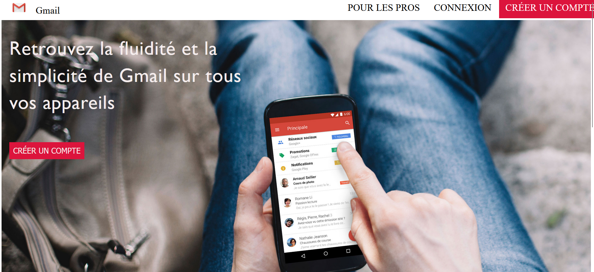

#**Partiel Gmail single page** 🚀 

##[Prévisualiser](https://lnstewill.github.io/etude-de-cas-gmail/){:target="_blank"}

**Maquette et objectif du projet**
>Premiére partie statique reproduire la msie en forme telle que présentée sur le fichier pdf

>Ensuite pour rendre dynamique nous allons utiliser ***php*** afin de mettre en place le reste des fonctionnalités
